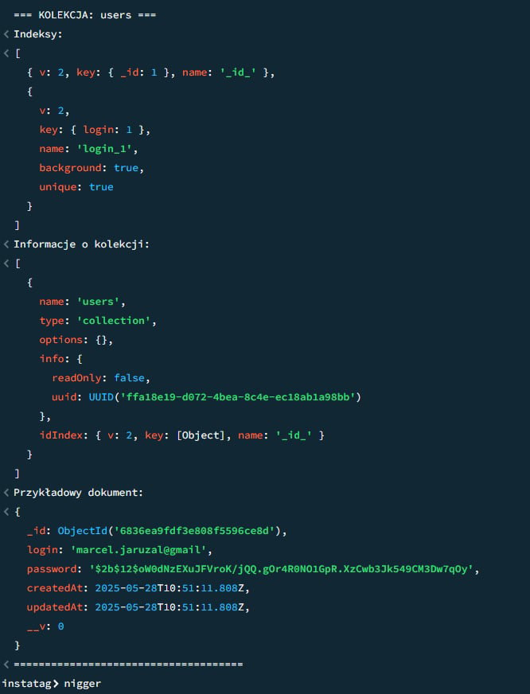
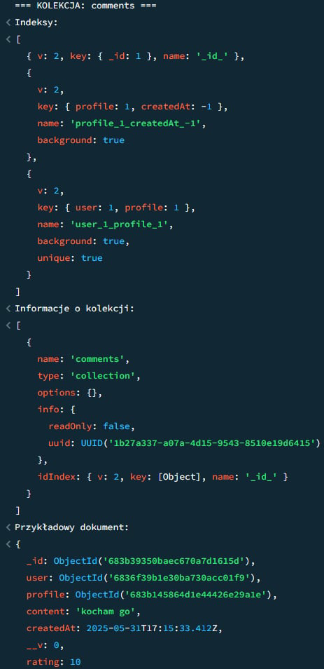
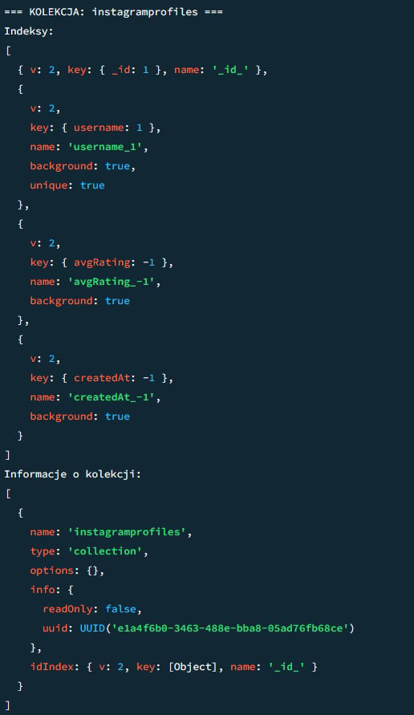

# Instagram Checker

## A. Wykonanie:

- **Cichocki Adrian**
- **Jaruzal Marcel**

---

## B. Opis aplikacji:

Nasza aplikacja webowa – **Instagram Checker** pozwala sprawdzić konto użytkownika Instagrama.  
**W jakim celu?** W dzisiejszych czasach jeżeli zadzwoni do nas obcy numer, mało kto odbiera i pyta „kto tam?”. Głównie wchodzimy w internet i wpisujemy _to za numer xxx xxx xxx_.

> _Dlatego właśnie postanowiliśmy, że może warto stworzyć coś podobnego, ale dla użytkowników Instagrama._

Gdy zaobserwuje nas ktoś, kogo nie znamy, możemy sprawdzić na naszej stronie opinie o tym koncie — czy to bot, nachalny typ który wysyła zdjęcia, czy zwykły użytkownik. Naszą inspiracją były właśnie strony do sprawdzania numerów telefonów oraz słynna **tablica-rejestracyjna.pl** 🚗.

### Setup

```bash
# backend
npm install
docker compose up --build

# frontend
npm run dev

# fixtures w backendzie
npm run fixtures

Hasła testowe:
Login	Hasło
admin	admin123
testuser1	test123
reviewer1	revi123
moderator	mod123

## C. Podział prac:
Nie dzieliliśmy się na frontend i backend, tylko na moduły.

Marcel zainicjalizował środowisko i aplikację, przygotował moduły rejestracji i logowania, usprawnił je.

Adrian stworzył moduł do szukania użytkowników Instagrama, a później moduły oceniania i komentarzy.

Inne funkcjonalności wykonywaliśmy wspólnie na zasadzie dobra ja zrobie to, a ty zrobisz tamto ;)

## D Baza Danych:




```
